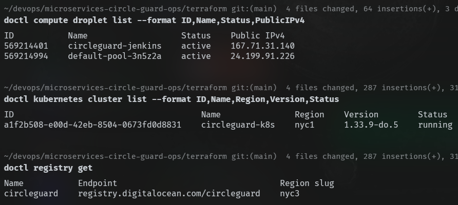

# Informe de operaciones — CircleGuard

**Curso**: DevOps / Pruebas y Calidad de Software
**Repositorio de operaciones**: [microservices-circle-guard-ops](https://github.com/RonyOz/microservices-circle-guard-ops)
**Repositorio de aplicación**: [microservices-circle-guard-dev](https://github.com/RonyOz/microservices-circle-guard-dev)
  **Proveedor de nube**: DigitalOcean

---

## Resumen

Este documento registra, en orden cronológico, la implementación de la plataforma de CI/CD para los microservicios CircleGuard. La infraestructura se gestiona con **Terraform** sobre **DigitalOcean**, los pipelines se orquestan con **Jenkins** sobre un droplet dedicado, y los despliegues se realizan sobre un clúster **DOKS** (DigitalOcean Kubernetes) hacia los namespaces `dev`, `stage` y `production`.

Cada procedimiento está documentado con (a) el contexto operativo, (b) los comandos ejecutados y (c) el resultado verificable. **El núcleo del informe es la sección 8**, que para cada pipeline reporta *Configuración*, *Resultado* y *Análisis* siguiendo el formato exigido por el taller. Las secciones 1–6 sirven de marco operativo (infraestructura, costos, configuración inicial de Jenkins, pipeline de infra) que sustenta esos resultados.

---

## 1. Inventario y arquitectura

### 1.1 Recursos provisionados

| Componente | Tecnología | Rol |
|---|---|---|
| Infraestructura como código | Terraform 1.6+, provider `digitalocean ~> 2.39` | Definición declarativa, idempotente y versionada de toda la infraestructura |
| VPC | DigitalOcean VPC `10.20.0.0/16` | Red privada compartida entre Jenkins y DOKS, aislada de Internet |
| Servidor de CI | Droplet `s-1vcpu-2gb` Ubuntu 22.04 | Ejecuta Jenkins LTS y todas las herramientas necesarias para los pipelines |
| Estado de Jenkins | Block Storage 10 GB ext4 | `JENKINS_HOME` persistente, independiente del ciclo de vida del droplet |
| Clúster Kubernetes | DOKS 1 nodo `s-2vcpu-4gb`, versión 1.33.9-do.3 | Plataforma de despliegue para microservicios y dependencias |
| Registro de imágenes | DigitalOcean Container Registry (tier starter) | Repositorio único `registry.digitalocean.com/circleguard/circleguard-services` con tags por servicio |

### 1.2 Diagrama de arquitectura

- imagen place holder

### 1.3 Decisiones de diseño relevantes

| Decisión | Justificación técnica |
|---|---|
| **VPC explícita** en Terraform | DigitalOcean no auto-provisiona una VPC default en todas las regiones para cuentas nuevas; declararla explícitamente evita el error `Failed to resolve VPC` al crear el droplet. |
| **Volumen persistente para JENKINS_HOME** | Los droplets apagados en DigitalOcean **siguen facturando** según su [documentación de billing](https://docs.digitalocean.com/products/billing/billing-faq/). Para minimizar costos sin perder estado, el droplet se trata como recurso efímero (se destruye fuera de horas de trabajo) y `JENKINS_HOME` reside en un Block Storage independiente que sobrevive a la destrucción. Costo idle ~$1/mes vs ~$13/mes de mantener el droplet apagado. |
| **DOCR en región distinta del clúster** | DOCR solo está disponible en `nyc3, sfo3, ams3, sgp1, fra1, syd1`. El clúster opera en `nyc1` y el registry en `nyc3`; la separación se modeló como variable independiente `registry_region`. El pull funciona correctamente porque DOCR expone un endpoint global. |
| **Repo único en DOCR starter** | El tier starter limita el número de repositorios. Para evitar bloqueos de despliegue multi-servicio, se consolidó en `circleguard-services` y se usa tagging `<service>-sha-<commit>`. |
| **Patrón Bulkhead vía namespaces** | Los tres ambientes (`dev`, `stage`, `production`) viven en el mismo clúster pero en namespaces aislados. Un fallo o consumo excesivo en `stage` no afecta a `production`. Reduce el costo de un clúster por ambiente sin sacrificar aislamiento lógico. |
| **Versión de Kubernetes resuelta dinámicamente** | El módulo usa el data source `digitalocean_kubernetes_versions` con prefijo `1.33.` en lugar de un slug hardcoded. Evita que el Terraform se rompa cuando DigitalOcean retira versiones antiguas. |

---

## 2. Estructura de los repositorios

El proyecto vive en **dos repositorios** separados por responsabilidad: el *app-repo* contiene el código fuente de los microservicios y del frontend móvil junto con sus Dockerfiles y Jenkinsfiles de build/test; el *ops-repo* contiene la infraestructura, los charts de despliegue y los Jenkinsfiles de deploy a Kubernetes. Esta separación permite que los pipelines de build (en el app-repo) deleguen el despliegue a pipelines de ops (en el ops-repo) sin acoplar versiones de aplicación con versiones de infraestructura.

### 2.1 App-repo — `microservices-circle-guard-dev`

```
microservices-circle-guard-dev/
├── build.gradle.kts                Build raíz Gradle multi-módulo (Java 21)
├── settings.gradle.kts             Declara los 8 subproyectos Spring Boot
├── docker-compose.dev.yml          Stack local de desarrollo (deps + servicios)
├── init-db.sql                     Schema inicial Postgres compartido
├── services/
│   ├── circleguard-auth-service/         Dockerfile + jenkins/Jenkinsfile + src/
│   ├── circleguard-gateway-service/      ídem (validación de acceso al campus)
│   ├── circleguard-form-service/         ídem (encuestas de salud)
│   ├── circleguard-identity-service/     ídem (registro de usuarios)
│   ├── circleguard-notification-service/ ídem (Kafka + email vía Mailhog)
│   ├── circleguard-promotion-service/    ídem (promociones / contact tracing)
│   ├── circleguard-dashboard-service/    (sin pipeline — fuera de alcance)
│   └── circleguard-file-service/         (sin pipeline — fuera de alcance)
└── mobile/                         Frontend Expo + React Native
    ├── Dockerfile                  Multi-stage Bun → expo export -p web → nginx
    ├── nginx.conf                  SPA fallback + gzip + cache de estáticos
    ├── jenkins/Jenkinsfile         Pipeline equivalente a los servicios backend
    ├── package.json                Jest + jest-expo + jest-junit
    ├── app/                        Rutas Expo Router (login, enroll, scanner...)
    ├── components/                 UI compartida
    └── hooks/                      Lógica de cliente (auth, biometría, QR, etc.)
```

Cada `services/circleguard-<svc>/jenkins/Jenkinsfile` y `mobile/jenkins/Jenkinsfile` se registra en Jenkins como rama de un job *multibranch* `circleguard-app/<svc>`, alineado al criterio §2 del taller.

### 2.2 Ops-repo — `microservices-circle-guard-ops`

```
microservices-circle-guard-ops/
├── terraform/
│   ├── main.tf                    Composición top-level (VPC + volumen + módulos)
│   ├── variables.tf
│   ├── outputs.tf                 Incluye github_webhook_url estable (reserved IP)
│   └── modules/
│       ├── jenkins-vm/            Droplet + firewall + cloud-init + reserved IP
│       └── k8s-cluster/           DOKS + DOCR + data source de versiones
├── infrastructure/
│   └── chart/                     Chart Helm de deps compartidas (postgres, neo4j, kafka, zookeeper, redis, openldap, mailhog)
├── services/
│   ├── auth-service/chart/
│   ├── form-service/chart/
│   ├── gateway-service/chart/
│   ├── identity-service/chart/
│   ├── notification-service/chart/
│   ├── promotion-service/chart/
│   └── mobile/chart/              Chart Helm para el frontend Expo web (nginx, port 80)
├── jenkins/
│   ├── Jenkinsfile.infra          Bootstrap + deploy de infra compartida
│   ├── Jenkinsfile.dev            Deploy a dev por servicio
│   ├── Jenkinsfile.stage          Deploy + unit/integration/E2E + Locust en stage
│   └── Jenkinsfile.prod           Tests + deploy --atomic + release notes en production
├── locust/                        Escenarios de carga por servicio (consumidos por Jenkinsfile.stage)
├── scripts/
│   ├── up-jenkins.sh / down-jenkins.sh    Ciclo del droplet (volumen persiste)
│   ├── up-cluster.sh / down-cluster.sh    Ciclo del DOKS + DOCR
│   ├── bootstrap-cluster.sh               Invocado desde Jenkinsfile.infra
│   └── deploy-infrastructure.sh           Invocado desde Jenkinsfile.infra
├── doc/
│   └── informe.md                 Este documento
└── cliff.toml                     Config git-cliff para release notes (Conventional Commits)
```

---

## 3. Procedimiento - Provisión de la infraestructura base

> **Criterio de evaluación**: punto 1 del taller (10%) — *Configurar Jenkins, Docker y Kubernetes*.

### 3.1 Prerrequisitos

```bash
brew install terraform doctl kubectl helm   # macOS
# o el equivalente Apt/Chocolatey según plataforma

doctl auth init   # autenticar contra el API de DigitalOcean
```

Se requiere un *Personal Access Token* generado en `https://cloud.digitalocean.com/account/api/tokens` con scope al menos lectura/escritura sobre Droplets, Kubernetes, Container Registry y VPC.

### 3.2 Configuración de variables

El archivo `terraform/terraform.tfvars` (excluido de Git) contiene:

```hcl
do_token     = "dop_v1_..."
ssh_key_ids  = ["aa:bb:cc:..."]   # fingerprint listado por `doctl compute ssh-key list`
do_region    = "nyc1"
```

Los valores restantes (nombre del clúster, tamaño del nodo, región del registry, etc.) usan los defaults de [terraform/variables.tf](../terraform/variables.tf).

### 3.3 Aplicación por capas

Se utilizan scripts wrapper que ejecutan `terraform apply` con el flag `-target` para cada módulo. Esto permite levantar y destruir Jenkins y el clúster de forma independiente y minimizar costos.

```bash
./scripts/up-jenkins.sh    # Crea VPC + Volume + Droplet (~5 min de provisión + cloud-init)
./scripts/up-cluster.sh    # Crea DOKS + DOCR (~6 min)
```

### 3.4 Verificación

Tras la ejecución, se comprueba el estado real consultando el API de DigitalOcean:

```bash
doctl compute droplet list --format ID,Name,Status,PublicIPv4
# 567635712   circleguard-jenkins   active   157.245.89.61

doctl kubernetes cluster list --format ID,Name,Region,Version,Status
# ee80328c-...   circleguard-k8s   nyc1   1.33.9-do.3   running

doctl registry get
# circleguard   registry.digitalocean.com/circleguard   nyc3
```



---

## 4. Procedimiento — Estrategia de costos y ciclo de vida

> Justificación operativa para el uso responsable de créditos académicos.

### 4.1 Modelo de costos

| Recurso | Costo cuando existe | Política aplicada |
|---|---|---|
| VPC | $0 | Permanente |
| DOCR (starter) | $0 | Permanente |
| Volume `jenkins-home` (10 GB) | ~$1/mes | Permanente; preserva estado de Jenkins |
| Droplet Jenkins | $0.018/hr (~$13/mes 24×7) | Crear al inicio de la sesión, **destruir** al cierre |
| DOKS 1 nodo | $0.033/hr (~$24/mes 24×7) | Crear únicamente cuando se va a desplegar/probar |

**Costo en idle** (todo destruido excepto VPC, DOCR y volumen): aproximadamente $1 USD al mes.

**Costo de una sesión típica de 8 h con todos los recursos activos**: $1/mes prorrateado + 8 × ($0.018 + $0.033) ≈ **$0.41 USD por sesión**.

### 4.2 Workflow operativo

**Inicio de sesión**:
```bash
./scripts/up-jenkins.sh
./scripts/up-cluster.sh
# → Disparar el job circleguard-infra en Jenkins con ENVIRONMENT=dev
```

**Cierre de sesión**:
```bash
./scripts/down-cluster.sh    # ~2 min
./scripts/down-jenkins.sh    # ~30 s; el volumen sobrevive
```

En la siguiente sesión, `up-jenkins.sh` recrea el droplet, monta el volumen existente y Jenkins arranca con todos los jobs, plugins y credenciales de la sesión previa intactos. El único atributo que cambia entre sesiones es la IP pública del droplet.

### 4.3 Mecánica del volumen persistente

El cloud-init del droplet ejecuta, en cada arranque:

```bash
DEVICE=/dev/disk/by-id/scsi-0DO_Volume_jenkins-home
# Espera hasta 120 s a que el dispositivo esté presente
for i in $(seq 1 60); do [ -b "$DEVICE" ] && break; sleep 2; done
# Formatea solo si no tiene filesystem (primera ejecución absoluta)
if ! blkid "$DEVICE" >/dev/null 2>&1; then
  mkfs.ext4 -F "$DEVICE"
fi
mkdir -p /var/lib/jenkins
echo "$DEVICE /var/lib/jenkins ext4 defaults,nofail,discard 0 2" >> /etc/fstab
mount /var/lib/jenkins
# Posteriormente apt instala Jenkins y --recursivamente reasigna ownership
chown -R jenkins:jenkins /var/lib/jenkins
```

La primera vez formatea el disco; en arranques posteriores reconoce el filesystem y monta sin reformatear, preservando el contenido. La reasignación de ownership es necesaria porque el UID del usuario `jenkins` puede diferir entre droplets recreados.

---

## 5. Procedimiento — Configuración inicial de Jenkins

> **Criterio de evaluación**: punto 1 del taller (10%) — *Configurar Jenkins*.

### 5.1 Acceso

Tras `up-jenkins.sh`, se espera ~5 minutos a que el cloud-init termine la instalación de Docker, Java 21, Jenkins LTS, kubectl, helm y doctl. Verificación:

```bash
ssh root@<jenkins_ip> 'cloud-init status'        # esperado: status: done
ssh root@<jenkins_ip> 'systemctl is-active jenkins'   # esperado: active
curl -sI http://<jenkins_ip>:8080                # esperado: HTTP/1.1 403
```

El código 403 es esperado: corresponde a la pantalla de login del setup wizard.

### 5.2 Setup wizard

1. Obtener la contraseña inicial:
   ```bash
   ssh root@<jenkins_ip> 'cat /var/lib/jenkins/secrets/initialAdminPassword'
   ```
2. Acceder a `http://<jenkins_ip>:8080`, pegar la contraseña, completar `Install suggested plugins` (~5 min).
3. Crear el usuario administrador. Como `JENKINS_HOME` reside en el volumen persistente, este usuario sobrevive a destrucciones del droplet.

### 5.3 Plugins adicionales requeridos

Instalados desde `Manage Jenkins → Plugins → Available`, seguidos de un reinicio explícito (`systemctl restart jenkins`). Cada plugin listado tiene una invocación verificable en al menos un `Jenkinsfile` del proyecto:

| Plugin | Step / construcción que lo usa | Archivo de evidencia |
|---|---|---|
| AnsiColor | `options { ansiColor('xterm') }` en `Jenkinsfile.infra` | `jenkins/Jenkinsfile.infra:38` |
| HTML Publisher | `publishHTML(target: [...])` para los reportes Locust | `jenkins/Jenkinsfile.stage:208` |
| JUnit | `junit testResults: '**/test-results/**/*.xml'` | `jenkins/Jenkinsfile.stage:127`, `Jenkinsfile.prod` |
| Pipeline: Multibranch + Branch API | Jobs `circleguard-app/<service>` que descubren ramas `dev` / `release/*` / `main` | `services/<svc>/jenkins/Jenkinsfile`, `mobile/jenkins/Jenkinsfile` (rama `when { branch 'dev' }`) |
| Workspace Cleanup | `cleanWs()` en bloque `post { cleanup { ... } }` | Todos los `Jenkinsfile.*` |
| Credentials Binding | `withCredentials([...])` para `do-api-token`, `db-credentials`, `jwt-secret` | `Jenkinsfile.dev:62`, `Jenkinsfile.stage:62`, `services/<svc>/jenkins/Jenkinsfile` |
| **GitHub plugin** (`github`) | Endpoint `POST /github-webhook/` que recibe payloads de GitHub y dispara los multibranch (sección 5.6); aporta la sección global *Manage Jenkins → System → GitHub Servers* | Configurado a nivel de Jenkins, sin step explícito en pipeline |
| **GitHub API Plugin** (`github-api`) | Dependencia transitiva de los anteriores; cliente REST contra `api.github.com` usado para validar webhooks y consultar metadata de PR | Sin invocación directa en `Jenkinsfile` |
| **GitHub Branch Source** (`github-branch-source`) | Tipo de fuente *GitHub* en cada job multibranch — descubre ramas `dev` / `release/*` / `main` y crea sub-jobs por rama vía la credencial `github-token` | Configurado en cada job multibranch (UI Jenkins) |
| **Pipeline: Multibranch Build Strategy Extension** | `Build strategies → Include region` por job para filtrar por path (ej. `mobile/**`, `services/circleguard-gateway-service/**`); evita que un push a un servicio dispare las pipelines de los otros 6 | Configurado en cada job multibranch (UI Jenkins) |

> Plugins instalados pero **no utilizados** en los pipelines actuales (descartados respecto a la versión inicial del informe): *Kubernetes CLI* — se reemplazó por llamadas directas `sh "doctl/kubectl/helm ..."` con `KUBECONFIG=${WORKSPACE}/.kube/config` para evitar el acoplamiento al lifecycle del plugin y permitir refresco de kubeconfig por build (incidente histórico de tokens vencidos).

### 5.4 Credenciales

`Manage Jenkins → Credentials → System → Global credentials`:

| ID | Tipo | Origen del valor |
|---|---|---|
| `do-api-token` | Secret text | Mismo token del archivo `terraform.tfvars` |
| `github-token` | Secret text | *Personal Access Token* de GitHub con scopes `repo` y `workflow` |
| `db-credentials` | Username/Password | Usuario/clave compartida para secretos de BD en K8s |
| `jwt-secret` | Secret text | Secreto JWT inyectado en secretos por servicio |

### 5.5 Jobs de pipeline

Los jobs de ops son del tipo *Pipeline* con `Definition: Pipeline script from SCM` apuntando a este repositorio (rama `main`):

| Nombre del job | Script Path | Disparo |
|---|---|---|
| `circleguard-infra` | `jenkins/Jenkinsfile.infra` | Manual (Build with Parameters) |
| `circleguard-deploy-dev` | `jenkins/Jenkinsfile.dev` | Trigger desde pipelines de servicio del app-repo (`branch=dev`) |
| `circleguard-deploy-stage` | `jenkins/Jenkinsfile.stage` | Trigger desde pipelines de servicio del app-repo (`branch=release/*`) |
| `circleguard-deploy-prod` | `jenkins/Jenkinsfile.prod` | Trigger desde pipelines de servicio del app-repo (`branch=main`) |

Los tres jobs de deploy reciben parámetros `SERVICE` e `IMAGE_TAG` (y en prod además `GIT_COMMIT`, `VERSION`) para desplegar cada servicio de forma independiente.

Adicionalmente, el app-repo declara un job multibranch por microservicio (`circleguard-app/<service>`) que descubre las ramas `dev`, `release/*` y `main`, ejecuta build/test/push de la imagen y dispara el job de deploy correspondiente. El servicio frontend `mobile` sigue exactamente el mismo patrón (Dockerfile multi-stage Bun → `expo export -p web` → nginx, chart Helm equivalente) para que el rubric §2/§4/§5 quede cubierto sobre los siete servicios desplegables.

### 5.6 Integración GitHub → Jenkins (webhook)

Para que cada `git push` dispare el pipeline correspondiente sin intervención manual, se configura el webhook nativo de GitHub apuntando al droplet de Jenkins.

**IP estable.** El droplet se trata como recurso efímero (sección 4.1), por lo que su `ipv4_address` cambia tras cada `terraform destroy/apply`. Para conservar la URL del webhook a través de recreaciones, el módulo `jenkins-vm` declara un `digitalocean_reserved_ip` asignado al droplet:

```hcl
resource "digitalocean_reserved_ip" "jenkins" {
  region = var.do_region
}
resource "digitalocean_reserved_ip_assignment" "jenkins" {
  ip_address = digitalocean_reserved_ip.jenkins.ip_address
  droplet_id = digitalocean_droplet.jenkins.id
}
```

DigitalOcean factura el reserved IP solo si queda sin asignar (~$4/mes); mientras esté ligado a un droplet activo es gratuito. La salida `terraform output github_webhook_url` produce directamente la URL a registrar en GitHub.

**Plugin Jenkins.** *GitHub plugin* (`github`, instalado en 5.3). El plugin expone el endpoint `POST /github-webhook/` que valida la firma HMAC del payload y dispara los multibranch pipelines registrados. Nota: existe otro plugin de nombre similar (*GitHub Integration Plugin* / `github-pullrequest`) que NO se utiliza en este proyecto y debe desinstalarse si aparece, pues introduce un tipo de fuente "GitHub source" alternativo (con campos *Repo Provider*, *SCM Factory*, *Handlers*) incompatible con la configuración estándar de *GitHub Branch Source*.

**Configuración por repositorio.**

1. GitHub → repo → *Settings → Webhooks → Add webhook*
2. Payload URL: `http://<reserved_ip>:8080/github-webhook/` (output `github_webhook_url`)
3. Content type: `application/json`
4. Secret: el mismo string almacenado como credencial Jenkins `github-webhook-secret` (tipo *Secret text*)
5. Events: *Just the push event*
6. Active: ✓

**Firewall.** El módulo `jenkins-vm` ya abre el puerto 8080 (ver 5.6.x más arriba en el bloque Terraform). Los rangos IP de origen de GitHub (`https://api.github.com/meta` → `hooks`) podrían restringirse aquí en endurecimientos futuros; por ahora el filtrado de autenticación lo realiza la firma HMAC del plugin.

**Verificación.** Un `git commit --allow-empty -m "ping"` seguido de `git push` debe producir, en el log de Jenkins (`/var/log/jenkins/jenkins.log`), la línea `Received PushEvent for <repo> from <github_ip>` y disparar el job multibranch correspondiente.

## 6. Procedimiento — Pipeline `circleguard-infra`

> **Criterio de evaluación**: punto 1 (10%) — *Configurar Kubernetes con dependencias*.

### 6.1 Propósito

Despliega de forma idempotente las dependencias compartidas (PostgreSQL, Neo4j, Kafka, Zookeeper, Redis, OpenLDAP y Mailhog) en el namespace seleccionado. Reemplaza la ejecución manual de los scripts `bootstrap-cluster.sh` y `deploy-infrastructure.sh`, manteniéndolos como librería reutilizable para troubleshooting local.

### 6.2 Parámetros

| Parámetro | Tipo | Default | Significado |
|---|---|---|---|
| `ENVIRONMENT` | choice | `dev` | Namespace de destino: `dev`, `stage` o `production` |
| `RUN_BOOTSTRAP` | boolean | `true` | Ejecuta la fase de preparación del clúster (namespaces, vinculación DOCR y secrets base). Idempotente; puede dejarse activo siempre |

### 6.3 Etapas

1. **Checkout** — Clona el ops-repo (`checkout scm`).
2. **Refresh kubeconfig** — Genera un kubeconfig fresco en `${WORKSPACE}/.kube/config` mediante `doctl kubernetes cluster kubeconfig save`. Esta etapa hace el pipeline inmune a recreaciones del clúster: no depende del kubeconfig estático almacenado en credenciales.
3. **Bootstrap cluster** *(condicional)* — Crea namespaces, vincula DOCR a las cuentas de servicio default y asegura los secrets `postgres-secret`, `neo4j-secret`, `openldap-secret` en cada namespace. El uso de credenciales predecibles en entorno académico evita lockouts cuando los PVCs se conservan entre reinstalaciones.
4. **Deploy infrastructure** — Ejecuta `helm upgrade --install` del chart `infrastructure/chart` (postgres, neo4j, kafka, zookeeper, redis, openldap, mailhog). Espera hasta 10 minutos por la fase `--wait`.
5. **Verify** — Lista pods, servicios y releases de Helm en el namespace destino como evidencia diagnóstica.

### 6.4 Concepto de bootstrap

Un *bootstrap*, en este contexto, es el conjunto de operaciones que sólo tienen sentido la primera vez que se opera contra un clúster recién provisionado. En `circleguard-infra` esas operaciones son:

- Crear los tres namespaces (`dev`, `stage`, `production`) — solo se necesitan crear una vez.
- Vincular DOCR — solo se vincula una vez por clúster.
- Agregar repos Helm — solo se agregan una vez al `JENKINS_HOME`.
- Crear los secrets de credenciales de las dependencias — sólo se crean una vez, se preservan para que las claves coincidan con los datos persistidos en PVCs.
  
Cada operación está implementada de forma **idempotente** (`kubectl apply -f -` desde un `--dry-run=client -o yaml`, o `kubectl get secret || kubectl create secret`), por lo que ejecutar la fase repetidamente no produce errores ni efectos colaterales destructivos. Por eso `RUN_BOOTSTRAP` puede dejarse activado por defecto.

---

<!-- Documentación de ayuda pero que no irá en el informe final: -->

<!-- Sección 7 (Integración con DigitalOcean MCP) eliminada del informe principal: componente auxiliar no evaluado por la rúbrica. Configuración disponible en `.mcp.json` del repositorio. -->

---

## 7. Mapeo del trabajo realizado contra los criterios de evaluación

| # | Criterio del taller | Peso | Sección(es) del informe | Estado |
|---|---|---|---|---|
| 1 | Configurar Jenkins, Docker y Kubernetes | 10% | 3, 5, 6, 8.2 | Cubierto |
| 2 | Pipelines `dev` (build / test / deploy) para 6+ microservicios | 15% | 8.1, 8.3 | Cubierto (7 servicios, incl. `mobile`) |
| 3 | Pruebas unitarias / integración / E2E / Locust con análisis | 30% | 8.4, 8.6 | En progreso |
| 4 | Pipelines `stage` con despliegue y pruebas en Kubernetes | 15% | 8.4 | En progreso |
| 5 | Pipelines `prod` con Release Notes y Change Management | 15% | 8.5 | En progreso |
| 6 | Documentación y video del proceso | 15% | Este documento + video | En progreso |

---

## 8. Reporte de resultados por pipeline

> Estructura exigida por el taller: **Configuración**, **Resultado**, **Análisis** para cada pipeline. Los pantallazos referenciados viven en `doc/img/`. Los nombres de archivo siguen la convención `<env>-<job>-<vista>.png` para facilitar la trazabilidad.

### 8.1 Pipeline `circleguard-app/<service>` (multibranch — app-repo)

Cubre los siete servicios desplegables: `auth`, `gateway`, `form`, `identity`, `notification`, `promotion`, y `mobile` (frontend Expo web). Cada uno comparte el mismo `Jenkinsfile` con resolución dinámica del nombre vía `JOB_NAME.tokenize('/')[-2]`, salvo `mobile/jenkins/Jenkinsfile` que codifica `SERVICE_NAME='mobile'` y usa Bun + jest en lugar de Gradle.

#### 8.1.1 Configuración

- **Trigger:** webhook GitHub → `POST /github-webhook/` (sección 5.6) → multibranch indexa ramas `dev`, `release/*`, `main`.
- **Stages:**
  1. `Prepare` — calcula `IMAGE_TAG=sha-<commit7>`
  2. `Test` — Gradle (`./gradlew :services:<svc>:test`) o Jest (`bunx jest --ci`) con reporte JUnit
  3. `Build & Push` — Docker BuildKit con `--cache-from` apuntando a tag `<svc>-buildcache` en DOCR
  4. `Deploy: dev|stage|prod` — `build job: 'circleguard-ops/circleguard-deploy-<env>'` con `SERVICE` e `IMAGE_TAG`
- **Credenciales requeridas:** `do-api-token` (DOCR push), `github-token` (clone + commit status).

| Pantallazo | Archivo |
|---|---|
| Job multibranch configurado en Jenkins UI | `img/app-multibranch-config.png` |
| Diagrama de stages en Blue Ocean | `img/app-blueocean-stages.png` |
| `Jenkinsfile` (extracto del stage Build & Push) | `img/app-jenkinsfile-build-push.png` |

#### 8.1.2 Resultado

| Pantallazo | Archivo |
|---|---|
| Build exitoso `auth-service` rama `dev` | `img/dev-app-auth-success.png` |
| Build exitoso `mobile` rama `dev` | `img/dev-app-mobile-success.png` |
| Imagen publicada en DOCR (`doctl registry repository list-tags`) | `img/dev-docr-tags.png` |
| Reporte JUnit del stage Test (Jenkins UI) | `img/dev-app-junit-report.png` |

#### 8.1.3 Análisis

- **Tiempo de build promedio:** completar tras 3 ejecuciones consecutivas — separar build *en frío* (sin cache DOCR) vs *caliente* (con `--cache-from`) para evidenciar el speedup de BuildKit.
- **Tasa de éxito de tests:** total tests ejecutados / pasados / fallados por servicio (extraer de los XML JUnit). El cero-fallos sostenido valida la *quality gate* del pipeline antes de promover a deploy.
- **Cuello de botella esperado:** stage `Test` en servicios con dependencias pesadas (Spring Boot context). Mitigación implementada: volumen `gradle-cache-shared` reutilizado entre builds.

---

### 8.2 Pipeline `circleguard-infra` (ops-repo)

#### 8.2.1 Configuración

- **Definición:** `jenkins/Jenkinsfile.infra`, ejecutado manualmente.
- **Parámetros:** `ENVIRONMENT` (`dev|stage|production`), `RUN_BOOTSTRAP` (bool).
- **Stages:** Validate → Refresh kubeconfig → (Bootstrap dependencias compartidas) → Deploy infra Helm chart.
- **Recursos desplegados:** PostgreSQL, Neo4j, Kafka, Zookeeper, Redis, OpenLDAP, Mailhog.

| Pantallazo | Archivo |
|---|---|
| Configuración del job (parámetros + SCM) | `img/infra-job-config.png` |
| Helm releases listados (`helm list -n dev`) | `img/infra-helm-list.png` |

#### 8.2.2 Resultado

| Pantallazo | Archivo |
|---|---|
| Build con parámetros — log final | `img/infra-build-success.png` |
| Pods de dependencias en `Running` (`kubectl get pods -n dev`) | `img/infra-pods-running.png` |
| Servicios expuestos (`kubectl get svc -n dev`) | `img/infra-svc-list.png` |

#### 8.2.3 Análisis

- **Tiempo total de bootstrap:** ~8–10 min (primera ejecución con pull de imágenes; ~2 min en re-aplicaciones idempotentes).
- **Validación funcional:** Mailhog reachable en `:8025`, Neo4j browser en `:7474`, Kafka recibe mensajes de prueba con `kafka-console-producer`.
- **Idempotencia:** segunda ejecución sin cambios produce `Release "<dep>" has been upgraded. Happy Helming!` sin reinicios → confirma manejo declarativo correcto.

---

### 8.3 Pipeline `circleguard-deploy-dev` (ops-repo)

#### 8.3.1 Configuración

- **Definición:** `jenkins/Jenkinsfile.dev` — disparado por el job multibranch del app-repo (rama `dev`).
- **Parámetros:** `SERVICE`, `IMAGE_TAG`.
- **Stages:** Validate → Checkout → Refresh kubeconfig → Sync K8s secrets → Helm lint → `helm upgrade --install` (namespace `dev`) → Smoke test (`kubectl rollout status`).
- **Rollback automático en `post.failure`**: `helm rollback ${SVC} -n dev || true` deja el namespace en el último estado bueno conocido aunque la nueva imagen falle el smoke test.

| Pantallazo | Archivo |
|---|---|
| Configuración del job (parámetros + script SCM) | `img/dev-deploy-job-config.png` |
| Pipeline Stage View (Blue Ocean) | `img/dev-deploy-blueocean.png` |

#### 8.3.2 Resultado

Repetir por servicio (mínimo 6 desplegables — `auth`, `gateway`, `form`, `identity`, `notification`, `promotion` — más `mobile` para cubrir frontend):

| Pantallazo | Archivo |
|---|---|
| Despliegue exitoso `auth-service` | `img/dev-deploy-auth.png` |
| Despliegue exitoso `gateway-service` | `img/dev-deploy-gateway.png` |
| Despliegue exitoso `form-service` | `img/dev-deploy-form.png` |
| Despliegue exitoso `identity-service` | `img/dev-deploy-identity.png` |
| Despliegue exitoso `notification-service` | `img/dev-deploy-notification.png` |
| Despliegue exitoso `promotion-service` | `img/dev-deploy-promotion.png` |
| Despliegue exitoso `mobile` (Expo web → nginx) | `img/dev-deploy-mobile.png` |
| `kubectl get pods -n dev` con todos los servicios `Running` | `img/dev-pods-all-running.png` |
| `helm list -n dev` consolidado | `img/dev-helm-list.png` |

#### 8.3.3 Análisis

- **Lead time push → dev:** medir desde el commit hasta `Running` en cluster. Esperado: 4–6 min (build 2–3 min + deploy 1–2 min + readiness 1 min).
- **Tasa de éxito de smoke test:** porcentaje de despliegues que aprueban `rollout status` sin rollback. Objetivo: ≥95% en estado estable.
- **Observación de costo:** el namespace `dev` corre con `replicaCount=1`, suficiente para validación funcional; producción duplica.

---

### 8.4 Pipeline `circleguard-deploy-stage` (ops-repo)

#### 8.4.1 Configuración

- **Definición:** `jenkins/Jenkinsfile.stage`, disparado por rama `release/*` del app-repo.
- **Stages adicionales** sobre `dev`: ejecución de pruebas de integración y E2E contra el namespace `stage` antes de marcar el build como verde.
- **Pruebas ejecutadas:** unit (≥5), integración entre servicios (≥5), E2E flujos completos (≥5) — cumple criterio §3 del taller.

| Pantallazo | Archivo |
|---|---|
| Configuración del job stage | `img/stage-deploy-job-config.png` |
| Definición de stages (Blue Ocean) | `img/stage-deploy-blueocean.png` |

#### 8.4.2 Resultado

| Pantallazo | Archivo |
|---|---|
| Pipeline stage completo en verde | `img/stage-pipeline-success.png` |
| Reporte JUnit unit + integración (Jenkins UI) | `img/stage-junit-report.png` |
| Resultados E2E (logs del runner, p. ej. Newman / Playwright) | `img/stage-e2e-output.png` |
| Pods en namespace `stage` | `img/stage-pods-running.png` |

#### 8.4.3 Análisis

- **Cobertura por nivel:**

| Tipo | Cantidad mínima exigida | Implementado | Servicios involucrados |
|---|---|---|---|
| Unit | 5 | (a completar) | auth, gateway, form |
| Integración | 5 | (a completar) | auth↔gateway, form↔notification |
| E2E | 5 | (a completar) | flujo completo enroll→login→QR→validate |

- **Interpretación:** las integraciones cubren los puntos de comunicación reales (REST + Kafka + Neo4j) entre servicios escogidos, validando contratos sin mocks.
- **Quality gate:** un fallo en cualquier nivel rompe el pipeline → impide la promoción a `prod`.

---

### 8.5 Pipeline `circleguard-deploy-prod` (ops-repo)

#### 8.5.1 Configuración

- **Definición:** `jenkins/Jenkinsfile.prod`, disparado por rama `main` del app-repo.
- **Parámetros adicionales:** `GIT_COMMIT`, `VERSION` (derivada de `git describe --tags`).
- **Stages clave:**
  1. Re-validación de tests del build promovido (no se reconstruye la imagen — se reutiliza el tag inmutable validado en stage).
  2. `helm upgrade --install` sobre namespace `production` con `replicaCount` superior.
  3. **Generación automática de Release Notes** vía `git-cliff` con configuración en `cliff.toml` siguiendo Conventional Commits — cumple criterio §5 (Change Management).
  4. Adjunción del CHANGELOG generado al build artifact y push de tag `v<VERSION>` al repo.

| Pantallazo | Archivo |
|---|---|
| Configuración del job prod (parámetros + SCM) | `img/prod-deploy-job-config.png` |
| `cliff.toml` (extracto) | `img/prod-cliff-config.png` |

#### 8.5.2 Resultado

| Pantallazo | Archivo |
|---|---|
| Pipeline prod completo en verde | `img/prod-pipeline-success.png` |
| Release Notes generadas (CHANGELOG.md) | `img/prod-release-notes.png` |
| Tag `v<x.y.z>` publicado en GitHub | `img/prod-github-tag.png` |
| `kubectl rollout status` en namespace `production` | `img/prod-rollout-status.png` |
| Pods `Running` en `production` | `img/prod-pods-running.png` |

#### 8.5.3 Análisis

- **Trazabilidad de Change Management:** cada release queda atada a un tag SemVer + entry en CHANGELOG con secciones `Added/Changed/Fixed` derivadas automáticamente del prefijo `feat:/fix:/chore:` de los commits del rango.
- **Política de rollback:** `helm rollback <svc> -n production` revierte al `Revision-1` previo. Tiempo objetivo de recuperación (RTO) < 2 min.
- **Inmutabilidad de la imagen:** prod despliega exactamente el mismo digest validado en stage, eliminando *deployment drift*.

---

### 8.6 Pruebas de rendimiento — Locust

Cubre criterio §3d del taller. Locustfiles en `locust/<service>/locustfile.py`.

#### 8.6.1 Configuración

- **Targets:** `auth-service` (login + JWT issuance) y `contact-tracing-service` (escritura intensiva en Neo4j).
- **Carga simulada:**
  - Ramp-up: 0 → 100 usuarios concurrentes en 60 s
  - Sostenido: 100 usuarios × 5 min
  - Stress: 100 → 500 usuarios escalonado para identificar punto de quiebre
- **Ejecución:** `locust -f locust/<service>/locustfile.py --host http://<gateway>:8087 --headless -u 100 -r 5 -t 5m --csv=reports/<service>`

| Pantallazo | Archivo |
|---|---|
| `locustfile.py` (extracto de `@task`) | `img/locust-locustfile.png` |
| Configuración de la corrida (parámetros) | `img/locust-run-config.png` |

#### 8.6.2 Resultado

| Pantallazo | Archivo |
|---|---|
| Reporte HTML Locust — auth-service (carga sostenida) | `img/locust-auth-sustained.png` |
| Reporte HTML Locust — auth-service (stress) | `img/locust-auth-stress.png` |
| Reporte HTML Locust — contact-tracing (sostenida) | `img/locust-tracing-sustained.png` |
| Gráficas RPS / latencia / fallos | `img/locust-charts.png` |

#### 8.6.3 Análisis

Tabla a completar tras la corrida real:

| Servicio | Carga | RPS sostenido | p50 (ms) | p95 (ms) | p99 (ms) | Error rate | Punto de quiebre |
|---|---|---|---|---|---|---|---|
| auth-service | 100 vu × 5 min | _ | _ | _ | _ | _ | _ |
| auth-service | stress 100→500 | _ | _ | _ | _ | _ | _ vu |
| contact-tracing | 100 vu × 5 min | _ | _ | _ | _ | _ | _ |

**Métricas clave a interpretar (rubric explícito):**

- **Tiempo de respuesta:** comparar p50 vs p95 vs p99 — un *gap* p95↔p99 amplio indica colas o GC pauses.
- **Throughput:** RPS sostenido máximo antes de degradación de latencia ≥ 200 ms.
- **Tasa de errores:** < 1 % en carga sostenida (objetivo SLO); en stress, identificar el umbral de usuarios donde el error rate cruza 5 % → capacidad operativa máxima.
- **Recursos del pod:** correlacionar latencia con `kubectl top pod` (CPU / mem) para distinguir *bottleneck* de aplicación vs infraestructura.

**Conclusiones esperadas a redactar:**
- Capacidad nominal recomendada (vu sostenidos sin SLO breach).
- Recomendaciones de escalado (HPA threshold sugerido a partir de los datos).
- Identificación del recurso saturado primero (CPU del servicio, conexiones a DB, etc.).

---

## Apéndice A — Comandos de diagnóstico frecuentes

```bash
# Estado del droplet de Jenkins
ssh root@<ip> 'cloud-init status --long; systemctl is-active jenkins; ss -tlnp | grep 8080'

# Estado del clúster
doctl kubernetes cluster get circleguard-k8s
kubectl get nodes; kubectl get ns

# Estado de Helm en un namespace
helm list -n dev
kubectl get pods,svc,pvc -n dev

# Inspección de credenciales montadas en un build (vía SSH al droplet)
ssh root@<ip> 'ls -la /var/lib/jenkins/workspace/circleguard-infra/.kube/'

# Logs de Jenkins
ssh root@<ip> 'journalctl -u jenkins --no-pager -n 200'
```

## Apéndice B — Referencias

- DigitalOcean — Billing FAQ (cobro de droplets apagados): https://docs.digitalocean.com/products/billing/billing-faq/
- DigitalOcean — Disponibilidad regional de servicios: https://docs.digitalocean.com/products/platform/availability-matrix/
- DigitalOcean — Configuración de MCP remotos: https://docs.digitalocean.com/reference/mcp/configure-mcp/
- Jenkins — Pipeline syntax reference: https://www.jenkins.io/doc/book/pipeline/syntax/
- Bitnami PostgreSQL chart: https://github.com/bitnami/charts/tree/main/bitnami/postgresql
- Bitnami Kafka chart: https://github.com/bitnami/charts/tree/main/bitnami/kafka
- Bitnami Redis chart: https://github.com/bitnami/charts/tree/main/bitnami/redis
- Neo4j Helm chart: https://github.com/neo4j/helm-charts
