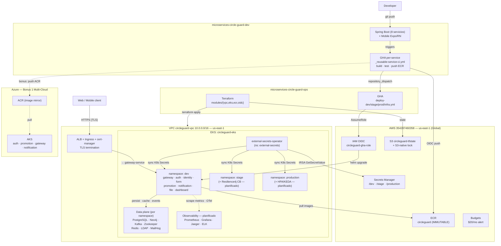

# Infrastructure

## Multi-Environment Strategy

CircleGuard usa el patrón **namespace-as-environment**: un solo cluster AWS EKS aloja tres namespaces aislados — `dev`, `stage`, `production`.

### Rationale

Tres clusters separados triplicarían el costo sin beneficio arquitectónico para un proyecto académico. El aislamiento por namespace provee:

- **Aislamiento de red**: pods en `dev` no pueden alcanzar pods en `production`
- **Aislamiento de secretos**: cada namespace sincroniza desde su propio path en AWS Secrets Manager (`circleguard/dev`, `circleguard/stage`, `circleguard/production`)
- **Deployments independientes**: un deploy roto en `stage` tiene cero impacto en `production`
- **Helm releases independientes**: mismo chart desplegado N veces, un release por namespace

### Limitación

Como todos los ambientes comparten un control plane, un upgrade de EKS o fallo del node group afecta los tres namespaces simultáneamente. Mitigación: node groups multi-AZ (nodos distribuidos en `us-east-1a` y `us-east-1b`).

---

## Repositorios

El sistema vive en dos repositorios con responsabilidades separadas:

| Repositorio | Rol |
|-------------|-----|
| `microservices-circle-guard-dev` | Código fuente Spring Boot (8 servicios) + Mobile (Expo/React Native) + GHA workflows por servicio (`_reusable-service-ci.yml`) |
| `microservices-circle-guard-ops` | Terraform, Helm charts, GHA de deploy (`deploy-dev/stage/prod/infra.yml`), Locust, E2E scripts, Trivy/ZAP scans |

---

## AWS Resources

```
AWS Account: 354287460358
Region: us-east-1
```

### Servicios Globales (fuera de VPC)

| Recurso | Nombre | Propósito |
|---------|--------|-----------|
| ECR Repository | `circleguard` | Registro de imágenes. Tag immutability activado. Todas las imágenes usan el patrón `<service>-sha-<commit7>` |
| IAM OIDC Provider | `token.actions.githubusercontent.com` | Federación OIDC para GitHub Actions — sin access keys de larga duración |
| IAM Role (GHA) | `circleguard-gha-role` | Asumido por GHA via `AssumeRoleWithWebIdentity`. Permisos: ECR push + EKS describe + Secrets Manager write |
| S3 Bucket | `circleguard-tfstate` | Estado remoto de Terraform con S3-native locking (Terraform ≥ 1.10, sin necesidad de DynamoDB) |
| Secrets Manager | `circleguard/dev`, `/stage`, `/production` | Secretos runtime (DB passwords, JWT key) leídos por pods via IRSA |
| AWS Budgets | — | Alerta a $20/mes para controlar costos del proyecto académico |

### Dentro de la VPC

```
circleguard-vpc (10.0.0.0/16)
├── us-east-1a
│   ├── public  subnet: 10.0.1.0/24  (ALB, NAT gateway)
│   └── private subnet: 10.0.10.0/24 (EKS nodes)
└── us-east-1b
    ├── public  subnet: 10.0.2.0/24
    └── private subnet: 10.0.11.0/24 (EKS nodes)
```

| Recurso | Nombre | Propósito |
|---------|--------|-----------|
| VPC | `circleguard-vpc` | Red aislada con subnets públicas y privadas en 2 AZs |
| EKS Cluster | `circleguard-eks` | Control plane gestionado (sin nodos self-managed) |
| ALB | — | Load balancer en subnets públicas. Termina TLS vía cert-manager. Enruta a `gateway-service` |
| Ingress Controller | — | Expone `gateway-service` y `dashboard-service` via Ingress con TLS |

---

## Namespaces y Environment Matrix

| Namespace | Ambiente | Node type | Min nodos | Max nodos | Notas |
|-----------|---------|-----------|-----------|-----------|-------|
| `dev` | Desarrollo | t3.medium | 1 | 2 | Deploy automático en cada push |
| `stage` | Staging | t3.medium | 1 | 3 | Deploy automático + E2E + Locust + Resilience4j CB (planificado) |
| `production` | Producción | t3.large | 2 | 5 | Aprobación manual + `--atomic` + HPA/KEDA (planificado) |

### Data Plane por namespace

Cada namespace tiene su propio stack de middleware, desplegado via `infrastructure/chart/`:

```
PostgreSQL · Neo4j · Kafka · Zookeeper · Redis · OpenLDAP · MailHog
```

| Componente | Versión | Uso |
|-----------|---------|-----|
| PostgreSQL | 16-alpine | auth, identity, form, dashboard (datos relacionales) |
| Neo4j | 5.26-community | promotion, dashboard (grafo de contactos, 14-day window) |
| Apache Kafka | 7.6.0 (Confluent) | Bus de eventos: `survey.submitted`, `promotion.status.changed` |
| Zookeeper | — | Coordinación de Kafka (single broker) |
| Redis | 7.2-alpine | QR token cache + health status cache |
| OpenLDAP | 1.5.0 | Directorio universitario para auth-service |
| MailHog | v1.0.1 | Captura de emails en dev/stage (puerto 8025 para debugging) |

---

## Terraform

### Estructura

```
terraform/aws/
├── main.tf                    # Módulo raíz
├── variables.tf
├── outputs.tf
├── terraform.dev.tfvars
├── terraform.stage.tfvars
├── terraform.prod.tfvars
├── backend.tf                 # S3 remote state
└── modules/
    ├── vpc/                   # VPC, subnets, IGW, NAT, route tables
    ├── eks-cluster/           # EKS control plane + managed node group + OIDC provider
    ├── ecr/                   # ECR repository + tag immutability + lifecycle policy
    ├── github-oidc/           # IAM OIDC provider + IAM role circleguard-gha-role
    └── irsa-secrets/          # IAM role para ESO (IRSA) + Secrets Manager secrets
```

### Workspace Pattern

Cada ambiente mapea a un workspace Terraform:

```bash
terraform workspace select dev        # o stage / production
terraform plan -var-file=terraform.dev.tfvars -out=tfplan
terraform apply tfplan
```

El workflow `infra.yml` (trigger manual) envuelve este proceso para uso en CI.

### Remote State

```hcl
# backend.tf
terraform {
  backend "s3" {
    bucket       = "circleguard-tfstate"
    key          = "circleguard/terraform.tfstate"
    region       = "us-east-1"
    use_lockfile = true   # S3-native locking — no requiere DynamoDB (TF ≥ 1.10)
  }
}
```

---

## Flujo CI/CD completo

```
Developer
  git push
       │
       ▼
microservices-circle-guard-dev
  GHA per-service workflow (_reusable-service-ci.yml)
  1. ./gradlew test
  2. docker build
  3. AssumeRoleWithWebIdentity → circleguard-gha-role
  4. docker push → ECR circleguard:<service>-sha-<commit7>
  5. repository_dispatch → ops repo
       │
       ▼
microservices-circle-guard-ops
  GHA deploy-dev.yml / deploy-stage.yml / deploy-prod.yml
  6. AssumeRoleWithWebIdentity → circleguard-gha-role
  7. aws eks update-kubeconfig --name circleguard-eks
  8. helm lint services/<service>/chart/
  9. helm upgrade --install <service> ... --namespace <env>
  10. kubectl rollout status deployment/<service>
  11. E2E smoke test (port-forward + e2e.sh)
       │
       ▼
EKS cluster
  namespace: dev / stage / production
  pods pull images desde ECR
  pods leen secrets via IRSA → Secrets Manager
```

**Runtime flow (usuario → app):**

```
Web client / Mobile app
  HTTPS (TLS terminado en ALB + cert-manager)
       │
       ▼
ALB → Ingress → gateway-service (Gatekeeper: valida QR token en Redis)
       │
       ▼
Servicios internos (auth · identity · form · promotion · notification · dashboard · file)
       │
       ▼
Data plane (PostgreSQL · Neo4j · Kafka · Redis · LDAP)
       │
       ▼ (via IRSA)
AWS Secrets Manager (DB_PASSWORD · JWT_SECRET · NEO4J_PASSWORD)
```

---

## Bootstrap Sequence

Pasos a ejecutar **una vez** después de `terraform apply`, por ambiente:

```bash
# 1. Configurar kubectl
aws eks update-kubeconfig --name circleguard-eks --region us-east-1

# 2. Instalar External Secrets Operator (o correr bootstrap-eso.yml workflow)
helm repo add external-secrets https://charts.external-secrets.io
helm upgrade --install external-secrets external-secrets/external-secrets \
  --namespace external-secrets --create-namespace \
  --set serviceAccount.annotations."eks\.amazonaws\.com/role-arn"=<ESO_ROLE_ARN>

# 3. Crear ClusterSecretStore + ExternalSecrets (aplica automáticamente via bootstrap-eso.yml)

# 4. Desplegar data plane por namespace
helm upgrade --install infrastructure infrastructure/chart/ \
  --namespace dev --create-namespace \
  --set externalSecrets.smSecretPath=circleguard/dev

# 5. Desplegar servicios via GitHub Actions (push al dev repo)
```

---

## Componentes planificados (no implementados aún)

Los siguientes componentes aparecen en el diagrama de arquitectura como planificados:

| Componente | Namespace | Estado | Sección rubric |
|------------|-----------|--------|----------------|
| Observability: Prometheus + Grafana + Jaeger | Todos | Planificado | Sección 7 |
| ELK Stack (Elasticsearch + Kibana + Filebeat) | Todos | Planificado | Sección 7 |
| Resilience4j Circuit Breaker | stage, production | Planificado | Sección 3.2 |
| HPA / KEDA (autoscaling) | production | Planificado | FinOps bonus |
| Istio (mTLS + VirtualService + Kiali) | stage o production | Planificado | Bonus 2 |
| Azure AKS + ACR (multi-cloud) | — | Planificado | Bonus 1 |

---

## Architecture Diagram



> **Convención de flechas:** sólidas = flujo runtime/deploy activo. Punteadas = planificado o bonus multi-cloud.
