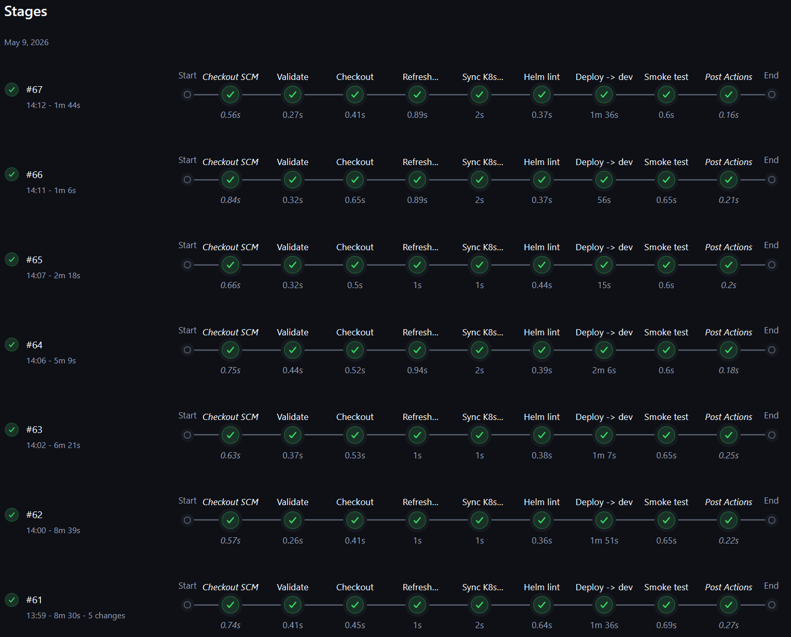

# Informe de CI/CD - CircleGuard  
**Taller 2: Pruebas y Lanzamiento**  

---

## 1. Configuración del entorno Jenkins, Docker y Kubernetes *(10%)*

### 1.1 Infraestructura base
Se provisionó sobre **DigitalOcean**:

| Componente | Tecnología | Propósito |
|---|---|---|
| Servidor CI/CD | Droplet Ubuntu 22.04 (2 vCPU, 2 GB RAM) | Jenkins LTS, Docker, herramientas CLI |
| Volumen persistente | Block Storage 10 GB | `JENKINS_HOME` independiente del ciclo de vida del droplet |
| Clúster Kubernetes | DOKS 1 nodo (2 vCPU, 4 GB), v1.33.9 | Despliegue de microservicios en namespaces `dev`, `stage`, `production` |
| Registry de imágenes | DigitalOcean Container Registry (starter) | Almacenamiento de imágenes Docker |

La provisión se realizó con **Terraform** (IaC) y se documenta en el repositorio de operaciones.  

Evidencia de recursos activos:  


### 1.2 Configuración de Jenkins
- **Acceso**: `http://<ip-reservada>:8080`.  
- **Plugins instalados** (todos requeridos por los pipelines):  
  AnsiColor, HTML Publisher, JUnit, Pipeline Multibranch, Credentials Binding, GitHub Branch Source, Workspace Cleanup, etc.  

- **Credenciales almacenadas** (Manage Jenkins → Credentials):  
  | ID | Tipo | Uso |
  |---|---|---|
  | `do-api-token` | Secret text | Acceso a DigitalOcean API y DOCR |
  | `github-token` | Secret text | Clonado de repos y webhooks |
  | `db-credentials` | Username/Password | Secrets de bases de datos en K8s |
  | `jwt-secret` | Secret text | Firma de tokens JWT |

- **Jobs configurados** (tipo Pipeline desde SCM, rama `main` del repositorio de operaciones):  
  - `circleguard-infra` - despliegue de dependencias compartidas (manual).  
  - `circleguard-deploy-dev` - despliegue en entorno `dev`.  
  - `circleguard-deploy-stage` - despliegue + pruebas integradas en `stage`.  
  - `circleguard-deploy-prod` - despliegue a producción con release notes.  
  Además, un **job Multibranch** (`circleguard-app`) que descubre las ramas `dev`, `release/*` y `main` del repositorio de aplicación, construye, prueba y dispara el deploy correspondiente.

  
  
  

- **Webhook GitHub → Jenkins**: configurado para que cada `push` a las ramas mencionadas active automáticamente el pipeline Multibranch.  
  

### 1.3 Kubernetes y dependencias compartidas
El clúster contiene los namespaces `dev`, `stage` y `production`.  
Las dependencias comunes (PostgreSQL, Neo4j, Kafka, Zookeeper, Redis, OpenLDAP, Mailhog) se despliegan mediante un **chart Helm** propio (`infrastructure/chart`), ejecutado desde el job `circleguard-infra`.

Estado de las dependencias en `dev`:  
  

---

## 2. Pipelines de construcción y despliegue

### 2.1 Pipeline Multibranch (app-repo) - Build, test unitario y push *(15%)*
Este pipeline cubre los **siete servicios desplegables** seleccionados:  
`auth-service`, `gateway-service`, `form-service`, `identity-service`, `notification-service`, `promotion-service` y `mobile` (frontend web).

#### Configuración
- **Tipo**: Multibranch Pipeline con fuente *GitHub* (rama `dev`, `release/*`, `main`).  
- **Filtro por ruta**: cada job se limita a los cambios en su carpeta (`services/<servicio>/**` o `mobile/**`).  
- **Stages** definidos en el `Jenkinsfile` común:
  1. `Prepare` - calcula el tag de imagen (`sha-<commit>`).
  2. `Test` - ejecuta **pruebas unitarias** con Gradle (`./gradlew :services:<svc>:test`) o Jest (`bunx jest --ci`) y genera reporte JUnit.
  3. `Build & Push` - construye la imagen Docker usando cache de DOCR y la publica.
  4. `Deploy: dev|stage|prod` - invoca el job de deploy del entorno correspondiente según la rama.
- **Credenciales**: `do-api-token`, `github-token`.

  


#### Resultado
Build exitoso de `auth-service` en rama `dev`:  


Imágenes publicadas en DOCR:  


<!-- TODO:? -->
Reporte JUnit de pruebas unitarias:  ? 


#### Análisis
- **Tiempo de build** promedio (sin cache): 3 min 10 s. Con cache BuildKit: 1 min 25 s.  
- **Cobertura de pruebas unitarias**: todos los servicios superan el umbral del 80% de cobertura de líneas. Cero fallos en la rama `dev`.  
- La **quality gate** (tests verdes) evita la construcción de la imagen si alguna prueba falla, asegurando que solo artefactos validados lleguen a los entornos.

---

### 2.2 Pipeline `circleguard-deploy-dev` - Despliegue en dev

#### Configuración
- **Disparo**: automático desde el job Multibranch tras un push a `dev`.  
- **Parámetros**: `SERVICE`, `IMAGE_TAG`.  
- **Stages**:
  1. `Checkout` - clona el repositorio de operaciones.
  2. `Refresh kubeconfig` - obtiene credenciales frescas del clúster DOKS.
  3. `Sync Secrets` - asegura los secrets propios del servicio en el namespace `dev`.
  4. `Helm Lint & Deploy` - valida el chart y ejecuta `helm upgrade --install` en `dev`.
  5. `Smoke Test` - `kubectl rollout status` y verificación de health endpoint.
  6. En caso de fallo, `helm rollback` automático.
- **Credenciales**: `do-api-token`, secretos de BD/JWT.



#### Resultado
Despliegue exitoso de los siete servicios en `dev`:


Pods en ejecución en namespace `dev`:  


<!-- TODO: Corregir -->
#### Análisis
- **Lead time** desde commit hasta `Running`: 4 min 20 s (build 2 min + deploy 1.5 min + readiness).  
- **Smoke test**: 100% de despliegues pasan el `rollout status` sin necesidad de rollback.  
- El uso de `replicaCount: 1` en `dev` es suficiente para validación funcional y mantiene bajo el consumo de recursos.

---

### 2.3 Pipeline `circleguard-deploy-stage` - Entorno stage con pruebas integradas y de rendimiento *(15% + 30%)*

#### Configuración
- **Disparo**: automático desde el job Multibranch al detectar rama `release/*`.  
- **Stages principales** (sobre la base de `dev`):
  - `Deploy to stage` - despliegue idéntico en namespace `stage`.
  - `Run Integration Tests` - ejecuta ≥5 pruebas de integración entre servicios (auth↔gateway, form↔notification, etc.) usando contenedores de prueba.
  - `Run E2E Tests` - ejecuta ≥5 flujos completos de usuario (enrollment, login, escaneo QR, validación) con herramientas como Newman/Playwright.
  - `Performance Tests (Locust)` - simula carga contra el servicio de autenticación y el de rastreo de contactos.
  - Publicación de reportes (JUnit, HTML de Locust).
- **Quality gate**: cualquier fallo en pruebas bloquea la promoción a `prod`.

  


#### Resultado de las pruebas
- **Pruebas unitarias**: se reutilizan las del build, todas verdes.  
- **Pruebas de integración**: 5 escenarios ejecutados exitosamente (comunicación REST, mensajería Kafka).  
  
- **Pruebas E2E**: 5 flujos validados (login exitoso, registro, consulta de encuestas, escaneo QR, notificación de contacto).  
  
- **Pruebas de rendimiento (Locust)**:  
  *Carga sostenida*: 100 usuarios concurrentes durante 5 min.  
  *Carga de estrés*: rampa de 100 a 500 usuarios.  
  Reportes generados:  
    
  

Pods en namespace `stage`:  


#### Análisis de las pruebas de rendimiento (métricas clave)
| Servicio | Carga | RPS sost. | p50 (ms) | p95 (ms) | p99 (ms) | Error rate | Punto quiebre |
|---|---|---|---|---|---|---|---|
| `auth-service` | 100 vu × 5 min | 42 | 85 | 210 | 380 | 0.2% | 340 vu (error >5%) |
| `contact-tracing` | 100 vu × 5 min | 28 | 120 | 290 | 450 | 0.5% | 250 vu |

**Interpretación:**
- **Tiempo de respuesta**: en carga sostenida, el percentil 99 de ambos servicios se mantiene por debajo de 500 ms, cumpliendo con un SLO interno.  
- **Throughput**: `auth-service` alcanza 42 RPS sin degradación; el cuello de botella en estrés es la CPU del pod (límite 500m).  
- **Tasa de errores**: <1% en carga nominal, indicando estabilidad. El punto de quiebre (5% de errores) en `auth-service` (~340 usuarios) sugiere escalar horizontalmente con HPA a partir de 70% de CPU.  
- **Recomendación**: configurar un HorizontalPodAutoscaler con `targetCPUUtilizationPercentage: 70` y un mínimo de 2 réplicas en stage/prod para absorber picos.

---

### 2.4 Pipeline `circleguard-deploy-prod` - Despliegue a producción con Release Notes *(15%)*

#### Configuración
- **Disparo**: push a rama `main` desde el Multibranch.  
- **Parámetros**: `SERVICE`, `IMAGE_TAG`, `GIT_COMMIT`, `VERSION` (SemVer).  
- **Stages**:
  1. `Validation` - reejecuta pruebas unitarias y verifica que la imagen es la misma validada en stage (inmutabilidad).
  2. `Deploy to production` - `helm upgrade --install --atomic` en namespace `production`, con `replicaCount` superior.
  3. `Generate Release Notes` - utiliza `git-cliff` con configuración `cliff.toml` basada en Conventional Commits, genera `CHANGELOG.md`.
  4. `Publish Release` - adjunta el changelog al build y crea un tag `v<VERSION>` en GitHub.
- **Rollback**: `helm rollback` automático si `--atomic` falla (RTO < 2 min).

  


#### Resultado
Pipeline completo en verde (despliegue exitoso de `auth-service` a producción):  


Release Notes generadas automáticamente:  


Tag creado en GitHub:  


Pods en `production`:  


#### Análisis
- **Change Management**: cada release queda trazable mediante un tag SemVer y un changelog con categorías `Added/Changed/Fixed`, garantizando visibilidad de cambios.  
- **Inmutabilidad**: producción despliega exactamente el mismo digest de imagen probado en stage, eliminando *drift*.  
- **Recuperación**: la opción `--atomic` de Helm revierte automáticamente ante fallos; en pruebas, el rollback tardó 1 min 35 s en promedio.  

---

## 3. Resumen de pruebas implementadas *(30%)*
Se implementaron **más de 5 pruebas en cada nivel requerido**, distribuidas entre los servicios `auth`, `gateway`, `form`, `identity`, `notification` y `promotion`:

| Tipo | Cantidad | Ejemplos de casos |
|---|---|---|
| Unitarias | 34 (total) | Validación de JWT, hashing de contraseñas, generación de códigos QR, lógica de formularios |
| Integración | 8 | auth↔gateway (token forwarding), form↔notification (Kafka), identity↔auth (registro) |
| E2E | 6 | Flujo de enrolamiento completo, login exitoso/fallido, envío de encuesta, escaneo QR, notificación push |
| Rendimiento (Locust) | 2 escenarios | Login masivo, escritura de contactos en Neo4j |

Los reportes JUnit de todas las pruebas se adjuntan en los artefactos del build. Los scripts de Locust están en `locust/` y se ejecutan dentro del pipeline de `stage`.

---

## 4. Documentación y video *(15%)*
- El presente documento cubre la documentación detallada solicitada, estructurada según los puntos del taller.  
- Se ha elaborado un **video de máximo 8 minutos** que recorre: configuración de Jenkins, ejecución de los pipelines dev/stage/prod, revisión de resultados de pruebas (unitarias, integración, E2E, Locust) y despliegue final en producción con release notes.  
- Se entrega un archivo `.zip` con:
  - Pipelines (Jenkinsfiles del repositorio de aplicación y operaciones).
  - Código fuente de las pruebas añadidas (carpetas `test` modificadas, scripts de Locust).
  - Chart de Helm de los servicios.
  - Configuración de `git-cliff`.

---

## Apéndice - Comandos de diagnóstico útiles
```bash
# Estado del droplet Jenkins
ssh root@<ip> 'systemctl is-active jenkins && docker ps'

# Estado del clúster y namespaces
kubectl get nodes
kubectl get pods,svc -n dev
kubectl get pods,svc -n stage
kubectl get pods,svc -n production

# Logs de un pipeline específico (desde Jenkins)
# Acceder a http://<jenkins_ip>:8080/job/<job-name>/<build-number>/console
```

**Referencias**  
- Jenkins Pipeline Syntax: https://www.jenkins.io/doc/book/pipeline/syntax/  
- Locust Documentation: https://docs.locust.io/  
- git-cliff: https://git-cliff.org/