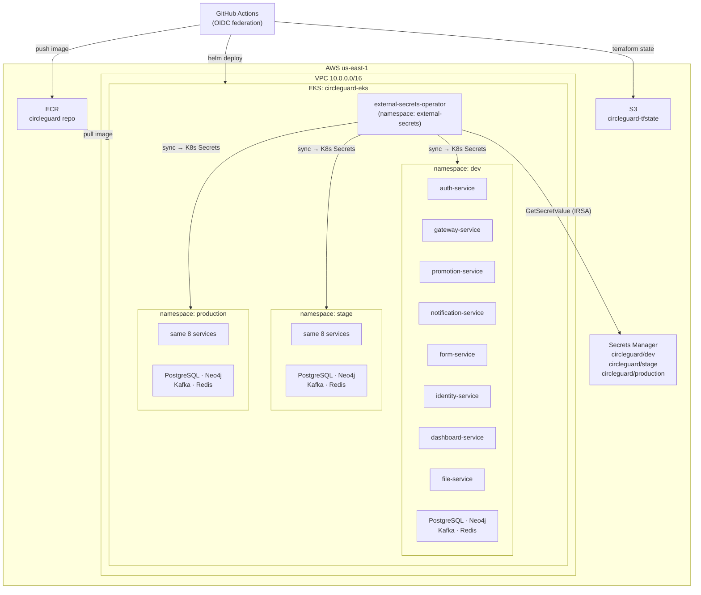

# Infrastructure

## Multi-Environment Strategy

CircleGuard uses a **namespace-as-environment** pattern: a single AWS EKS cluster hosts three isolated namespaces — `dev`, `stage`, and `production`.

### Rationale

Running three separate clusters would multiply cost by 3× with no architectural benefit for an academic project. Namespace isolation provides:

- **Network isolation**: services in `dev` cannot reach `production` pods (NetworkPolicy enforced by EKS)
- **Secret isolation**: each namespace has its own set of K8s Secrets synced from a separate AWS Secrets Manager path (`circleguard/dev`, `circleguard/stage`, `circleguard/production`)
- **Independent deployments**: a broken `stage` deploy has zero impact on `production`
- **Independent Helm releases**: same chart deployed N times, one release per namespace

### Limitation

Because all environments share one control plane, a node group failure or EKS upgrade affects all namespaces simultaneously. Mitigation: multi-AZ node groups (nodes spread across `us-east-1a` and `us-east-1b`).

---

## AWS Resources

```
AWS Account: 888900520630
Region: us-east-1
```

| Resource | Name / ARN | Purpose |
|----------|-----------|---------|
| VPC | `circleguard-vpc` | Isolated network with public + private subnets |
| EKS Cluster | `circleguard-eks` | Kubernetes control plane (managed, no self-managed nodes) |
| EKS Node Group | `circleguard-ng` | Managed EC2 worker nodes (see environment matrix below) |
| ECR Repository | `circleguard` | Single image repo; all services tagged `<service>-sha-<commit7>` |
| S3 Bucket | `circleguard-tfstate` | Terraform remote state (S3-native locking, Terraform ≥ 1.10) |
| IAM OIDC Provider | `token.actions.githubusercontent.com` | Enables GitHub Actions OIDC federation (no long-lived keys) |
| IAM Role (GHA) | `circleguard-gha-role` | Assumed by GHA workflows; has ECR push + EKS describe + SM permissions |
| IAM Role (ESO) | `circleguard-eso-role` | Assumed by external-secrets SA via IRSA; has SM GetSecretValue |
| Secrets Manager | `circleguard/dev`, `/stage`, `/production` | Runtime secrets (DB passwords, JWT key) read by pods via ESO |

### VPC Layout

```
circleguard-vpc (10.0.0.0/16)
├── us-east-1a
│   ├── public  subnet: 10.0.1.0/24  (NAT gateway, ALB)
│   └── private subnet: 10.0.10.0/24 (EKS nodes)
└── us-east-1b
    ├── public  subnet: 10.0.2.0/24
    └── private subnet: 10.0.11.0/24 (EKS nodes)
```

### Environment Matrix

| Environment | Namespace | Node type | Min nodes | Max nodes | Kafka | Neo4j |
|------------|-----------|-----------|-----------|-----------|-------|-------|
| dev | `dev` | t3.medium | 1 | 2 | in-cluster | in-cluster |
| stage | `stage` | t3.medium | 1 | 3 | in-cluster | in-cluster |
| production | `production` | t3.large | 2 | 5 | in-cluster | in-cluster |

All middleware (PostgreSQL, Neo4j, Kafka, Redis, OpenLDAP) is deployed via the shared `infrastructure/chart/` Helm chart into each namespace.

---

## Terraform

### Structure

```
terraform/aws/
├── main.tf                    # Root module wiring
├── variables.tf
├── outputs.tf
├── terraform.dev.tfvars
├── terraform.stage.tfvars
├── terraform.prod.tfvars
├── backend.tf                 # S3 remote state
└── modules/
    ├── vpc/                   # VPC, subnets, IGW, NAT, route tables
    ├── eks-cluster/           # EKS control plane + managed node group + OIDC
    ├── ecr/                   # ECR repository + lifecycle policy
    ├── github-oidc/           # IAM OIDC provider + GHA role
    └── irsa-secrets/          # ESO IRSA role + Secrets Manager secrets
```

### Workspace Pattern

Each environment maps to a Terraform workspace:

```bash
terraform workspace select dev        # or stage / production
terraform plan -var-file=terraform.dev.tfvars -out=tfplan
terraform apply tfplan
```

The `infra.yml` GitHub Actions workflow wraps this for CI use (manual trigger only).

### Remote State

```hcl
# backend.tf
terraform {
  backend "s3" {
    bucket       = "circleguard-tfstate"
    key          = "circleguard/terraform.tfstate"
    region       = "us-east-1"
    use_lockfile = true   # S3-native locking (no DynamoDB needed, TF ≥1.10)
  }
}
```

---

## Bootstrap Sequence

After `terraform apply` provisions the cluster, run these steps **once per environment**:

```bash
# 1. Configure kubectl
aws eks update-kubeconfig --name circleguard-eks --region us-east-1

# 2. Bootstrap External Secrets Operator (run bootstrap-eso.yml workflow, or manually):
helm repo add external-secrets https://charts.external-secrets.io
helm upgrade --install external-secrets external-secrets/external-secrets \
  --namespace external-secrets --create-namespace \
  --set serviceAccount.annotations."eks\.amazonaws\.com/role-arn"=<ESO_ROLE_ARN>

# 3. Deploy shared infrastructure (PostgreSQL, Neo4j, Kafka, Redis) per namespace:
helm upgrade --install infrastructure infrastructure/chart/ \
  --namespace dev --create-namespace \
  --set externalSecrets.smSecretPath=circleguard/dev

# 4. Deploy services via GitHub Actions (push to dev branch or trigger dispatch)
```

---

## Architecture Diagram


